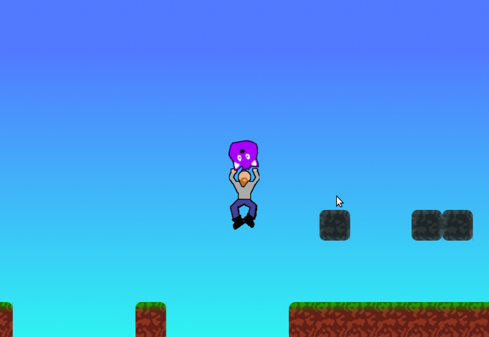

# Purple Thing!

A game for Ludum Dare 46 (theme: Keep it Alive).  A mini-platformer in which
you must toss around a fragile purple creature to get it to the end of the
level safely.  Made using [Phaser](https://phaser.io/).  Mostly tested in
Firefox.

Sorry for the terrible art and lack of sound.
